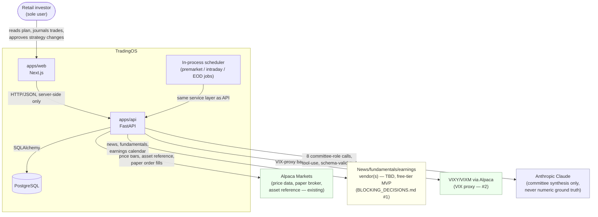
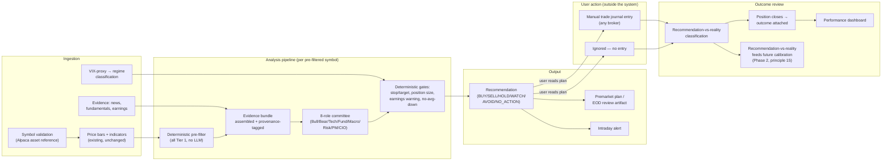
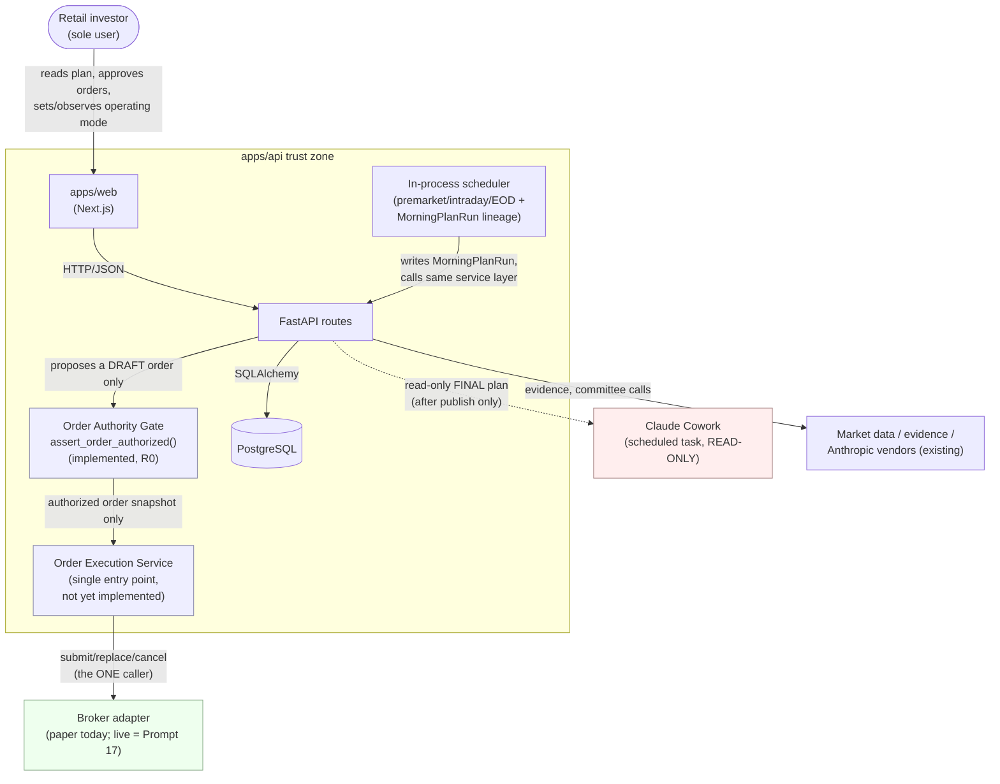

# Architecture

This document covers the shipped Phases 1–7 foundation (unchanged) plus the
bounded contexts the refinement brief adds. Nothing here is scaffolded yet —
this is the target architecture the blocking decisions
(docs/BLOCKING_DECISIONS.md) and MVP plan (docs/MVP_PLAN.md) assume.

## Context diagram



`apps/web` never talks to any external vendor directly — everything routes
through `apps/api`, the only place any secret is held (unchanged from the
shipped MVP). The scheduler is not a separate process or trust boundary; it
runs inside `apps/api` and calls the same service functions the HTTP routes
call (BLOCKING_DECISIONS.md #4) — there's no new external attack surface
from adding it.

## Data flow: ingestion → recommendation → user action → outcome review



Every arrow above crosses through the same audit-event write the shipped
MVP already established (principle 9) — not drawn per-arrow above for
readability, but every box that produces a new record writes one.

## The fact → calc → inference → decision pipeline (principle 2), extended

Unchanged in kind from the shipped MVP, extended in coverage:

1. **Observed facts** — Alpaca price bars/fills (existing), plus news
   headlines, fundamentals snapshots, earnings dates, VIX-proxy bars (new).
   All carry source/symbol/timestamp/timezone/freshness (principle 3);
   never fabricated (principle 4).
2. **Deterministic calculations** — existing indicators, plus: regime
   classification, ATR+structure stop/target, risk-budget position sizing,
   symbol-validation resolution, recommendation-vs-reality classification,
   active-trade-monitor suggestions. All plain code, unit-tested, versioned,
   no LLM involvement (principle 6).
3. **Model inferences** — existing single-call `/ask` synthesis, plus the
   8-role committee's structured outputs and the CIO's final narrative.
   Grounded only in tool results (evidence bundles + stage-2 calculations);
   never invents a number (principle 4/7).
4. **User decisions** — existing paper-order actions, plus: manual journal
   entries, watchlist tier changes, strategy-version approvals. Recorded,
   never inferred.

## Bounded contexts

Each context below is either **existing** (shipped Phases 1–7, unchanged)
or **new** (this refinement). New contexts follow the same
provider-abstraction and audit-event patterns the existing ones already
established — no new architectural pattern is introduced, only new
instances of the existing ones.

### 1. Market Data & Reference (existing, extended)
`Symbol`, `PriceBar`, `Indicator` (unchanged) + **new:** symbol validation
records (resolution status/reason, canonical match, raw input preserved).
Owns: "is this a real, tradable instrument, and what does its price history
actually say." Provider: Alpaca (`MarketDataProvider`, existing interface,
extended with an asset-reference lookup method).

### 2. Evidence & Context (new)
News items, fundamentals snapshots, earnings-calendar entries, VIX-proxy-
derived regime inputs. Owns: "what's true about this symbol and the market
right now, beyond price." Each evidence type gets its own thin provider
interface (`NewsProvider`, `FundamentalsProvider` — likely one vendor
covers both per BLOCKING_DECISIONS.md #1) following the exact shape of the
existing `MarketDataProvider`/`LLMProvider` Protocols — fakeable in tests,
swappable without touching callers. Every result carries the same
provenance envelope as `PriceBar` (FR-14).

### 3. Watchlist Management (new)
`Watchlist` + tiered membership, monitoring frequency. Owns: "what am I
actively tracking, and how often." Thin — mostly CRUD plus the rule that
membership requires a validation record (FR-05).

### 4. Regime & Risk Budget (new)
Regime classification (FR-01–FR-03) and its downstream effect on the
risk-budget/allocation ceiling used by context 6 below. Owns: "how
aggressive should sizing be right now, market-wide" — deliberately separate
from per-symbol analysis, since it's a portfolio-level, not symbol-level,
concern.

### 5. Investment Committee / Analysis Pipeline (new — the core expansion)
Orchestrates: deterministic pre-filter → evidence assembly → 8 committee
roles (parallel-callable Bull/Bear/Technical/Fundamental/Macro roles, then
sequential Risk Manager → Portfolio Manager → CIO/Judge, since the CIO
needs every other role's output plus the deterministic gates) → final
`Recommendation`. Reuses the existing `LLMProvider` interface and tool-use
pattern (docs/MODEL_GOVERNANCE.md) — each role is a distinct prompt
version + a distinct typed tool result schema, not 8 free-text calls.
Owns: "what does the evidence actually suggest, argued from multiple
angles, synthesized into one auditable call."

### 6. Deterministic Gates (new)
Stop/target (ATR+structure+gap+catalyst+trailing), position sizing
(risk-budget÷stop-distance, capped by allocation/liquidity/sector/
correlation/speculative-name limits), no-average-down precondition,
earnings-window warning. Owns: "the numbers the committee is not allowed to
invent or override" (principle 6/7) — structurally called *before* the CIO
role runs (FR-19), not after, so a blocked gate is never something the CIO
narrative could talk its way around.

### 7. Portfolio & Trade Journal (existing, extended)
Existing: `PaperPortfolio`/`PaperOrder` via the Alpaca adapter, kept as the
practice sandbox (BLOCKING_DECISIONS.md #5). **New:** `TradeJournalEntry` —
broker-agnostic, user-entered, the primary tracked portfolio. Both contexts
share the existing derived-position-from-events pattern (ADR-013) — a
journal's current holdings are computed from entries, never stored
redundantly.

### 8. Active Trade Monitor (new)
Reads open journal positions + context 6's stop/target logic, produces
hold/tighten/partial/exit/watch suggestions (FR-35). Owns: "should anything
change about a position I already hold" — deliberately reuses context 6's
math rather than a second stop/target implementation.

### 9. Scheduling & Workflows (new)
Premarket, intraday, EOD jobs (BLOCKING_DECISIONS.md #4). Owns: "when do
the above contexts actually run, unattended." In-process scheduler calling
existing service functions — not a distinct deployable, not a distinct
trust boundary.

### 10. Performance & Learning (existing, extended)
Existing: `StrategyVersion` governance loop, `BacktestRun`
(single-window). **New:** performance dashboard aggregation over the
journal, recommendation-vs-reality classification and outcome attachment.
Owns: "how well is this actually working, both the user's trading and the
system's calls." Walk-forward backtesting (docs/MVP_PLAN.md Phase 2) would
extend `BacktestRun`'s existing shape, not replace it.

### 11. Observability, Security, Audit (existing, extended)
Existing `AuditEvent` pattern, `.env`-only secrets, no client-side vendor
exposure. Extended to every new entity above (FR-48) — no new mechanism.

## Trust boundaries

Unchanged shape from the shipped MVP, more instances of the same boundary
type:

- **Browser ↔ `apps/api`** — the only boundary the user's own machine
  crosses; no secret ever crosses it (existing posture, docs/SECURITY.md).
- **`apps/api` ↔ each external vendor** (Alpaca, VIX-proxy — also Alpaca,
  the new evidence vendor(s), Anthropic) — each held behind its own
  Protocol interface; a vendor credential lives only in `apps/api`'s
  server-side environment, never logged, never in a prompt sent back to the
  user verbatim beyond the evidence text itself.
- **`apps/api` ↔ PostgreSQL** — unchanged, SQLAlchemy, least-privilege role
  (ADR-008).
- **Scheduler ↔ everything else** — not a new boundary; the scheduler is
  in-process and calls the same functions the API layer calls, under the
  same credentials, in the same trust zone.

See docs/THREAT_MODEL.md for the threats considered at each boundary above.

## Deployment topology

Unchanged single-personal-deployment shape (docs/OPERATIONS.md): one
`apps/api` process (now also running the in-process scheduler), one
`apps/web` process, one PostgreSQL instance, all on the same local machine
for MVP. No new deployable, no new process, no new network boundary beyond
the new outbound vendor calls listed above. A future move to Vercel/Supabase
(if ever pursued) would need the scheduler re-hosted as a real cron/worker
process at that point — flagged here as a known consequence of the
in-process choice (BLOCKING_DECISIONS.md #4), not a blocker for the current
local-personal-use deployment.

## Provider abstraction pattern (existing, extended)

`apps/api/src/tradingos_api/providers/` gains new Protocol interfaces
following the exact existing pattern (`MarketDataProvider`,
`PaperBrokerProvider`, `LLMProvider`): a `NewsProvider`/`FundamentalsProvider`
(evidence context) and possibly a distinct `RegimeDataProvider` if the
VIX-proxy lookup doesn't fit cleanly inside `MarketDataProvider`. No new
pattern — the same "callers depend on the interface, tests inject a fake,
a vendor swap doesn't touch call sites" reasoning applies identically.

## Monorepo layout, extended

```
TradingOS/
  apps/
    web/     (existing, extended with new pages — see docs/UX_MAP.md)
    api/
      src/tradingos_api/
        core/       (existing: settings, dependencies, rate limiter)
                    + scheduler wiring (new)
        db/         (existing, unchanged pattern)
        providers/  existing (alpaca_market_data, alpaca_paper_broker,
                    anthropic_llm) + new (news/fundamentals vendor,
                    regime/VIX-proxy — may reuse alpaca_market_data)
        models/     existing (symbol, price_bar, indicator, paper_*,
                    strategy_version, recommendation, backtest_run,
                    audit_event, llm_call_log)
                    + new (watchlist, watchlist_membership,
                    symbol_validation, news_item, fundamentals_snapshot,
                    earnings_event, regime_snapshot, committee_run,
                    trade_journal_entry, recommendation_outcome,
                    scheduled_artifact)
        schemas/    existing + new (one per new model, same pattern)
        routers/    existing + new (watchlist, symbol-validation,
                    committee/recommendations, journal, monitor,
                    performance, alerts)
        services/   existing (indicators, price_bars, portfolio,
                    reconciliation, scoring, strategy, backtest, ask,
                    llm_tools, llm_cost, audit)
                    + new (symbol_validation, regime, evidence,
                    committee, gates/sizing, gates/stops, journal,
                    monitor, performance, rec_vs_reality, scheduler_jobs)
  infra/     (unchanged)
  docs/      (this file + new: MVP_PLAN.md, UX_MAP.md, THREAT_MODEL.md,
              RISK_REGISTER.md, BLOCKING_DECISIONS.md)
```

No file above is created by this pass — this is the target structure for
whichever implementation phase follows, once docs/BLOCKING_DECISIONS.md is
confirmed.

---

## Revision Prompt R1 delta: trust-boundary diagram and architecture questions resolved

**Status: architecture-only.** Extends the bounded contexts above with the
order-authority/scheduler/Cowork boundaries PROJECT_INSTRUCTIONS.md's v2
amendment (Revision Prompt R0) requires. Nothing below changes what's
already implemented (Phase 8's schema/API, the standalone R0 policy
module) — it places those existing pieces on an explicit boundary diagram
and adds the new boundaries a future implementation phase must respect.

### Trust-boundary diagram



The two new hard boundaries this revision adds, both drawn with a
one-directional arrow on purpose:

- **`API` → `Cowork`** is one-directional and read-only (dotted, to mark
  it as the optional/off-by-default path) — there is no arrow the other
  way. Cowork cannot invoke anything; it can only be handed a finished,
  published artifact to summarize (SS-5, ADR-049).
- **`Policy` → `ExecSvc` → `Broker`** is the only path that can ever
  reach a broker adapter (OA-7). Every other component in the diagram —
  including `API`'s own recommendation/evidence code, the scheduler, and
  by extension any future Cowork or LLM-driven surface — can produce at
  most a `DRAFT` order or a plan artifact, never a submission.

### Architecture questions resolved

1. **Which services own market evidence, feature snapshots, strategy
   decisions, order proposals, approvals, and broker submission?**
   Unchanged bounded-context ownership from the table above, with two
   new/renamed owners this revision adds: the **Order Authority Gate**
   (`policy/order_authority.py`, implemented) owns *whether* a proposal
   may advance, and the **Order Execution Service** (not yet built, see
   docs/ORDER_AUTHORITY_MODEL.md) owns the *single* call path to a broker
   adapter. Market evidence remains context 2; feature snapshots for the
   earnings workflow are a new, narrow slice of context 2 (a `snapshot`
   table scoped to one event, not a new context); strategy decisions
   remain context 5 (the committee) plus context 6 (deterministic gates);
   order proposals are drafted by context 6/5's output, never by the
   evidence or scheduler layers directly.
2. **How are investment and tactical positions attributed if they share
   one broker symbol?** By `Recommendation` identity, not by broker
   symbol. A `Position`/`PositionLot` (Phase 8, unchanged) is keyed by
   `(account_id, instrument_id)` and remains a single aggregate at the
   account level — this revision does **not** split broker-level
   position tracking by lane (that would require the broker to understand
   a concept it has no notion of). Instead, attribution happens one layer
   up: each `Order` carries `linked_recommendation_version_id` (Phase 8,
   existing column), and that recommendation's `mode` (PM-1, once
   schema-backed) is what lets the journal/performance views compute
   "how much of this position's cost basis came from the Investment
   thesis vs. the Tactical setup" as a derived attribution report over
   the existing lot data — a new *read model*, not a new broker-facing
   concept.
3. **How will a morning plan remain reproducible when market data or
   news changes later?** Answered fully in docs/MORNING_PLAN_SPEC.md's
   "Reproducibility" section — snapshot-by-reference to already-immutable
   evidence/recommendation rows plus a `MorningPlanRun` lineage manifest,
   never live re-derivation.
4. **What data is required before the plan can be labeled COMPLETE?**
   Answered fully in docs/MORNING_PLAN_SPEC.md's "What data is required"
   section — per-symbol freshness/gate-completion checks, with an
   aggregate threshold deciding whether the whole plan is `INCOMPLETE`.
5. **What price movement invalidates an order approval?** Answered fully
   in docs/ORDER_AUTHORITY_MODEL.md's "Approval binding" section — a
   configurable threshold anchored to the position's own ATR-derived stop
   width, evaluated at submission time against the approval-time snapshot.
6. **How will the application prevent a Cowork task or LLM output from
   reaching the broker adapter directly?** Structurally, not by
   convention: the Order Execution Service is the only caller of any
   broker adapter method anywhere in the codebase (a property already
   proven for today's simpler `_apply_fill()` by
   `tests/test_policy_order_authority.py::TestBrokerBoundaryIsSingleEntryPoint`,
   and required to remain true for the future execution service by the
   same kind of structural test). Cowork and any LLM surface are wired
   only to read endpoints and to `DRAFT`-order-proposing code paths —
   neither is ever given a reference to the execution service, so there
   is no code path to remove, only one that was never granted.
7. **What happens when a recommendation is valid but the broker, quote,
   or scheduler is unavailable?** Answered fully in
   docs/ORDER_AUTHORITY_MODEL.md's dedicated section — the order stays in
   a pending/`APPROVED` state and either retries with bounded backoff or
   expires; nothing is ever submitted on an assumption in place of a
   missing fact.
8. **How are early-market, after-hours, and earnings-announcement timing
   handled?** `time_in_force`/`extended_hours` fields already exist on
   `Order` (Phase 8, `time_in_force`; an `outside_hours` flag is part of
   the approval-binding field set, OA-8) — early/after-hours submission
   requires that flag to be explicitly set and bound into the approval,
   never inferred silently from wall-clock time at submission. Earnings-
   announcement timing is handled entirely by
   docs/HYBRID_EARNINGS_STRATEGY.md's verified-event-time requirement
   (HES-2 condition 1) — an order for a name with an unverified or
   ambiguous announcement time/window cannot pass the pre-event gate at
   all, regardless of what session it would otherwise execute in.
9. **What deployment is required for reliable premarket scheduling?**
   Unchanged from BLOCKING_DECISIONS.md #4/R-07 (docs/RISK_REGISTER.md):
   the in-process scheduler requires the single personal machine to be
   on and awake at 05:45/06:10 America/Los_Angeles. This revision does
   not change that deployment requirement or upgrade it to a hosted
   always-on process — it is named again here because the Morning
   Decision Dashboard formalizes the plan as *the* default landing page,
   which raises the cost of a missed run from "inconvenient" to "the
   whole point of opening the app that morning didn't work," without
   changing the underlying mitigation (yesterday's plan + manual "run
   now," docs/UX_MAP.md). A move to a small always-on host remains a
   named, deferred option (R-07), not adopted by this pass.
10. **What acceptance gate must be passed before Prompt 17 can add a live
    adapter?** See docs/MVP_PLAN.md's "Paper release vs. live-confirmed
    release" section for the full gate — summarized here: every
    deterministic policy test (`tests/test_policy_order_authority.py` and
    its future schema-backed extensions) passing; a demonstrated paper-
    trading soak period with zero reconciliation discrepancies; the
    Order Execution Service's single-entry-point property re-verified by
    a structural test against the then-current codebase; the kill switch
    and cancel-open-orders controls (OA-9/SS-4) built and independently
    tested; and explicit, recorded user sign-off treating live capital
    risk as a distinct decision from "the paper feature set works" — no
    amount of paper-mode reliability alone satisfies this gate, since paper
    correctness and live-money authorization are deliberately different
    questions (principle 10/11).
