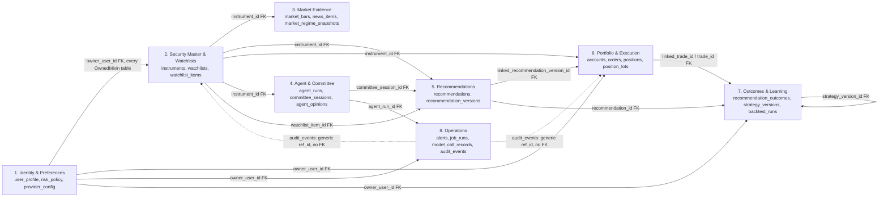
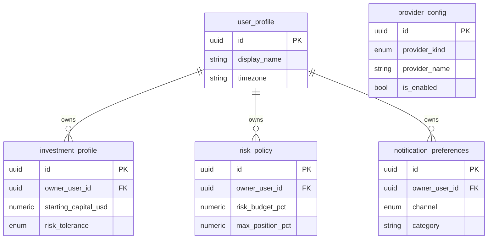
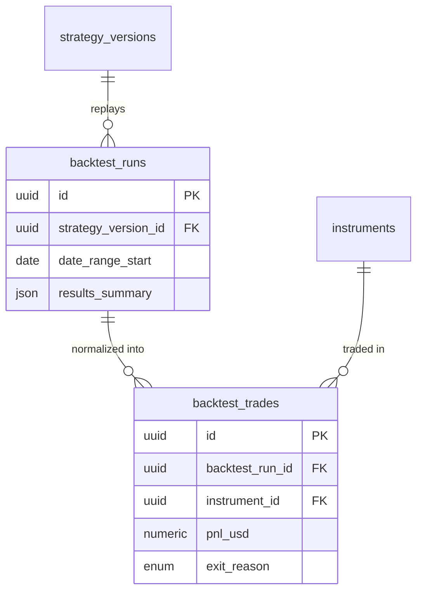
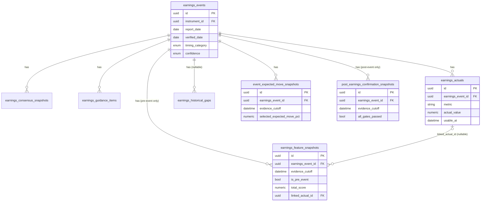
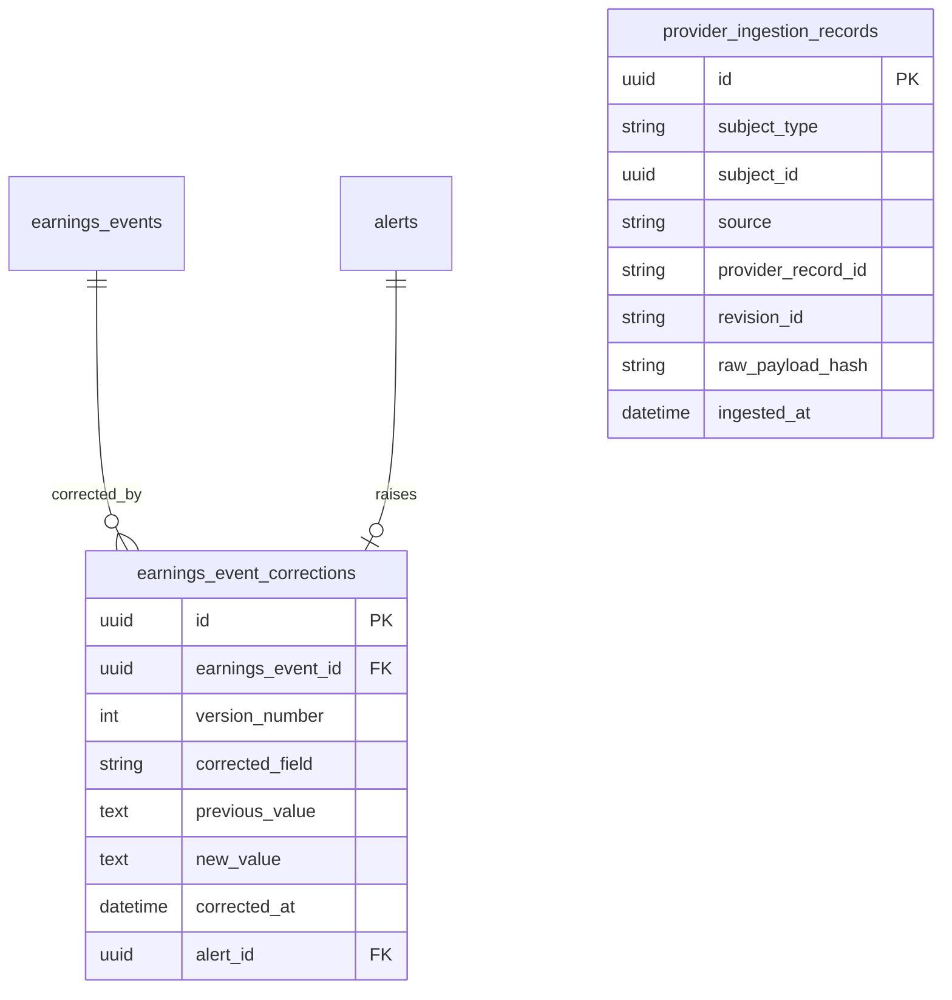
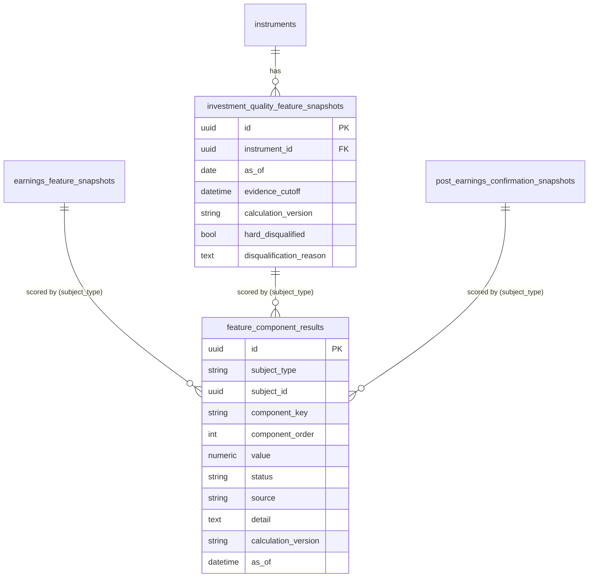
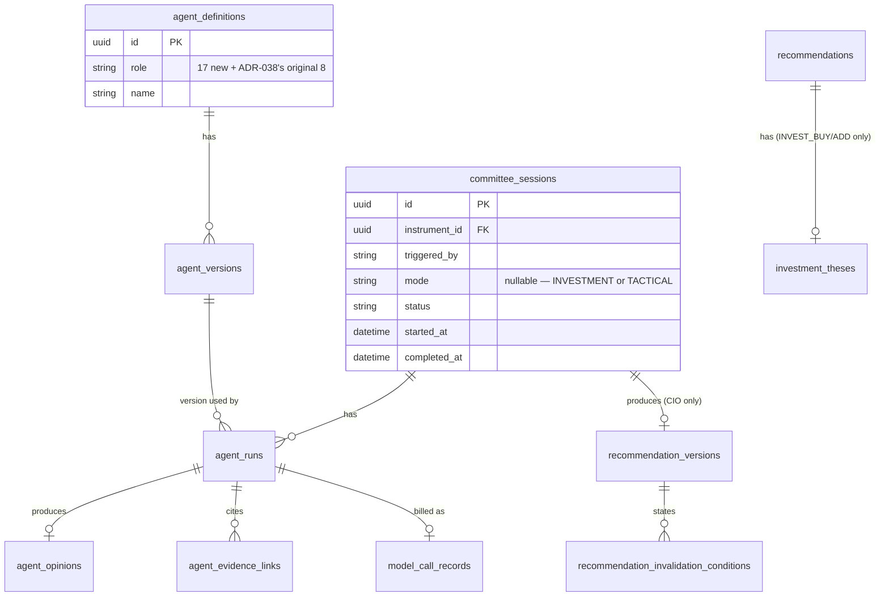
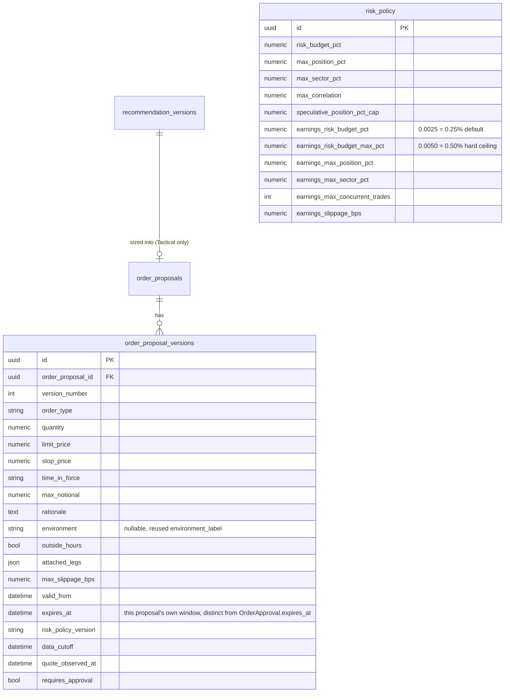

# Entity-Relationship Diagrams

A single ~70-entity ER diagram is unreadable, so this document is one
context-map overview (which bounded contexts reference which) followed by
one detailed Mermaid `erDiagram` per bounded context. Every table name
below matches `apps/api/src/tradingos_api/models/*.py` and
`docs/DATA_DICTIONARY.md` exactly. Attributes shown are the ones relevant
to relationships and key business rules — see the data dictionary for the
full column list of every table. Sections 10-13 are Revision Prompt R3's
additive bounded contexts (decision taxonomy & investment thesis,
earnings evidence, morning plan, order authority); strategy governance's
additions are two extra columns/rows on §7's existing tables, not a new
diagram.

## Context map



The dotted lines from `audit_events` and the generic-link tables
(`agent_evidence_links.evidence_id`, `data_quality_events.subject_id`,
`model_change_proposals.subject_ref_id`) are deliberately **not** real
foreign keys (ADR-015's original reasoning, carried forward) — one log
table spans many different target tables, so a single typed FK column
can't express it. `subject_type`/`evidence_type` is the discriminator.

## 1. Identity & preferences



## 2. Security master & watchlists

```mermaid
erDiagram
    sectors ||--o{ industries : contains
    industries ||--o{ instruments : classifies
    instruments ||--o{ instrument_aliases : "known as"
    instruments ||--o{ instrument_validation_events : "resolved from"
    instruments ||--o{ watchlist_items : "member via"
    user_profile ||--o{ watchlists : owns
    watchlists ||--o{ watchlist_items : contains

    sectors { uuid id PK, string name }
    industries { uuid id PK, uuid sector_id FK, string name }
    instruments {
        uuid id PK
        string ticker UK
        string name
        enum asset_type
        uuid industry_id FK
        bool active
    }
    instrument_aliases { uuid id PK, uuid instrument_id FK, string alias, string alias_type }
    instrument_validation_events {
        uuid id PK
        string raw_input
        enum status
        uuid canonical_instrument_id FK
    }
    watchlists { uuid id PK, uuid owner_user_id FK, string name }
    watchlist_items {
        uuid id PK
        uuid watchlist_id FK
        uuid instrument_id FK
        int tier
        int priority
        bool active
    }
```

## 3. Market evidence

Revision Prompt 4 adds a nullable `usable_at` point-in-time cutoff column
to `news_items`, `earnings_guidance_items`, `earnings_consensus_snapshots`,
`earnings_revisions`, and `fundamentals_snapshots` (not shown individually
below to keep this diagram readable — see docs/DATA_DICTIONARY.md §10 for
the full column list), plus `eps_dispersion`/`guidance_midpoint`/`units`
on the consensus/guidance tables and `invalidates_earnings_interpretation`/
`note` on `corporate_actions`. See §14 below for the two new P4 tables
(`earnings_event_corrections`, `provider_ingestion_records`).

```mermaid
erDiagram
    instruments ||--o{ market_bars : "priced by"
    instruments ||--o{ corporate_actions : "affected by"
    instruments ||--o{ technical_indicator_snapshots : "derived for"
    instruments ||--o{ fundamentals_snapshots : "reported for"
    instruments ||--o{ earnings_events : "reports"
    earnings_events ||--o{ earnings_revisions : revised_by
    instruments ||--o{ sentiment_snapshots : "scored for"
    instruments }o--o{ news_items : "mentions (via news_item_instruments)"

    market_bars { uuid id PK, uuid instrument_id FK, date as_of, enum timeframe, numeric close }
    corporate_actions { uuid id PK, uuid instrument_id FK, enum action_type, date ex_date }
    technical_indicator_snapshots {
        uuid id PK
        uuid instrument_id FK
        date as_of
        string indicator_name
        string version
        numeric value
    }
    fundamentals_snapshots { uuid id PK, uuid instrument_id FK, date as_of, numeric market_cap }
    earnings_events { uuid id PK, uuid instrument_id FK, date report_date, numeric eps_estimate }
    earnings_revisions { uuid id PK, uuid earnings_event_id FK, enum direction }
    news_items { uuid id PK, string canonical_url, string dedup_hash UK }
    news_item_instruments { uuid id PK, uuid news_item_id FK, uuid instrument_id FK }
    sentiment_snapshots { uuid id PK, uuid instrument_id FK, datetime as_of, numeric score }
    macro_observations { uuid id PK, string series_code, date as_of, numeric value }
    market_regime_snapshots { uuid id PK, date as_of UK, enum classification }
    data_quality_events { uuid id PK, string subject_type, uuid subject_id, uuid instrument_id FK }
```

## 4. Agent & committee orchestration

```mermaid
erDiagram
    agent_definitions ||--o{ agent_versions : versioned_by
    prompt_versions ||--o{ agent_versions : configures
    instruments ||--o{ committee_sessions : evaluated_in
    committee_sessions ||--o{ agent_runs : contains
    agent_versions ||--o{ agent_runs : executes_as
    agent_runs ||--o| agent_opinions : produces
    agent_runs ||--o{ agent_evidence_links : cites
    agent_runs ||--o{ model_call_records : "underlies (§8)"

    agent_definitions { uuid id PK, enum role UK, string name }
    agent_versions {
        uuid id PK
        uuid agent_definition_id FK
        string version_label
        uuid prompt_version_id FK
        string model_name
    }
    committee_sessions { uuid id PK, uuid instrument_id FK, enum status }
    agent_runs {
        uuid id PK
        uuid committee_session_id FK
        uuid agent_version_id FK
        enum status
        json input_snapshot
        json output_snapshot
    }
    agent_evidence_links { uuid id PK, uuid agent_run_id FK, string evidence_type, uuid evidence_id }
    agent_opinions { uuid id PK, uuid agent_run_id FK UK, string stance, json structured_output }
```

## 5. Recommendations

```mermaid
erDiagram
    instruments ||--o{ recommendations : "our call on"
    watchlist_items ||--o{ recommendations : "sourced from"
    committee_sessions ||--o{ recommendation_versions : "produced by"
    recommendations ||--o{ recommendation_versions : "has history of"
    recommendation_versions ||--o{ recommendation_levels : specifies
    recommendations ||--o{ recommendation_status_events : "transitions logged in"

    recommendations {
        uuid id PK
        uuid instrument_id FK
        uuid watchlist_item_id FK
        enum status
        datetime opened_at
    }
    recommendation_versions {
        uuid id PK
        uuid recommendation_id FK
        uuid committee_session_id FK
        int version_number
        enum action
        enum confidence
        numeric score
    }
    recommendation_levels { uuid id PK, uuid recommendation_version_id FK, enum kind, numeric price }
    recommendation_status_events {
        uuid id PK
        uuid recommendation_id FK
        enum from_status
        enum to_status
    }
    confidence_calibration_records { uuid id PK, enum confidence_band, date period_start }
```

## 6. Portfolio & execution

```mermaid
erDiagram
    user_profile ||--o{ accounts : owns
    accounts ||--o{ cash_ledger : "ledgered by"
    accounts ||--o{ positions : holds
    accounts ||--o{ orders : places
    instruments ||--o{ positions : "held as"
    instruments ||--o{ orders : "targets"
    positions ||--o{ position_lots : "composed of"
    orders ||--o| order_legs : "structured by"
    orders ||--o{ executions : fills
    executions ||--o{ fees : incurs
    executions ||--o{ position_lots : opens
    accounts ||--o{ trades : "round-trips in"
    trades ||--o| trade_theses : justified_by
    trades ||--o{ trade_notes : annotated_by
    trade_notes ||--o{ trade_attachments : attaches
    accounts ||--o{ portfolio_snapshots : "snapshotted as"
    accounts ||--o{ risk_snapshots : "risk-assessed as"

    accounts {
        uuid id PK
        uuid owner_user_id FK
        enum account_type
        numeric starting_cash
    }
    cash_ledger {
        uuid id PK
        uuid account_id FK
        enum entry_type
        numeric amount
        string idempotency_key UK
    }
    positions {
        uuid id PK
        uuid account_id FK
        uuid instrument_id FK
        numeric quantity
        numeric avg_cost
    }
    position_lots {
        uuid id PK
        uuid position_id FK
        uuid opened_execution_id FK
        numeric quantity_opened
        numeric quantity_remaining
        datetime closed_at
    }
    orders {
        uuid id PK
        uuid account_id FK
        uuid instrument_id FK
        enum side
        enum status
        string idempotency_key UK
    }
    order_legs { uuid id PK, uuid order_id FK UK, enum role, uuid bracket_group_id }
    executions { uuid id PK, uuid order_id FK, numeric quantity, numeric price }
    fees { uuid id PK, uuid execution_id FK, enum fee_type, numeric amount }
    trades { uuid id PK, uuid account_id FK, uuid instrument_id FK, enum status, numeric realized_pnl }
    trade_theses { uuid id PK, uuid trade_id FK, bool is_intact }
    trade_notes { uuid id PK, uuid trade_id FK, text note_text }
    trade_attachments { uuid id PK, uuid trade_note_id FK, string file_name }
    portfolio_snapshots { uuid id PK, uuid account_id FK, date as_of UK, numeric total_equity }
    risk_snapshots { uuid id PK, uuid account_id FK, datetime as_of, numeric gross_exposure_pct }
```

## 7. Outcomes & learning

```mermaid
erDiagram
    recommendations ||--o| recommendation_outcomes : "resolved into"
    trades ||--o| recommendation_outcomes : "matched to"
    recommendations ||--o{ hypothetical_trade_outcomes : "simulated for"
    trades ||--o{ trade_reviews : reviewed_by
    accounts ||--o{ performance_snapshots : "measured by"
    user_profile ||--o{ strategy_definitions : owns
    strategy_definitions ||--o{ strategy_versions : versioned_by
    strategy_versions ||--o{ scoring_weight_versions : "projects weights into"
    strategy_versions ||--o{ backtest_runs : "backtested as"
    user_profile ||--o{ model_change_proposals : proposes
    model_change_proposals ||--o{ model_change_approvals : "decided via"

    recommendation_outcomes {
        uuid id PK
        uuid recommendation_id FK UK
        enum classification
        uuid linked_trade_id FK
        numeric r_multiple
    }
    hypothetical_trade_outcomes { uuid id PK, uuid recommendation_id FK, numeric simulated_pnl_pct }
    trade_reviews { uuid id PK, uuid trade_id FK, enum rating }
    performance_snapshots { uuid id PK, uuid account_id FK, date period_start, numeric realized_pnl }
    benchmark_snapshots { uuid id PK, string benchmark_ticker, date period_start }
    strategy_definitions { uuid id PK, uuid owner_user_id FK, string name }
    strategy_versions {
        uuid id PK
        uuid strategy_definition_id FK
        json config
        enum status
    }
    scoring_weight_versions { uuid id PK, uuid strategy_version_id FK, string signal_name, numeric weight }
    model_change_proposals { uuid id PK, uuid owner_user_id FK, string subject_type, enum status }
    model_change_approvals { uuid id PK, uuid proposal_id FK, enum decision }
```

## 8. Backtesting



## 9. Operations

```mermaid
erDiagram
    user_profile ||--o{ alerts : owns
    instruments ||--o{ alerts : concerns
    alerts ||--o{ alert_deliveries : "delivered via"
    prompt_templates ||--o{ prompt_versions : versioned_by
    agent_runs ||--o{ model_call_records : "billed to (nullable — §4)"

    alerts {
        uuid id PK
        uuid owner_user_id FK
        uuid instrument_id FK
        enum severity
        enum status
    }
    alert_deliveries { uuid id PK, uuid alert_id FK, enum channel, enum status }
    job_runs { uuid id PK, string job_name, enum status, string idempotency_key UK }
    prompt_templates { uuid id PK, enum agent_role, string name }
    prompt_versions { uuid id PK, uuid prompt_template_id FK, string version_label, text body }
    model_call_records {
        uuid id PK
        uuid agent_run_id FK
        string model
        int input_tokens
        numeric cost_usd
    }
    audit_events { uuid id PK, string record_type, uuid ref_id, json snapshot }
```

## 10. Revision Prompt R3 — decision taxonomy & investment thesis

`recommendations.mode` (new column, ADR-046) is the lane discriminator —
an Investment and a Tactical `Recommendation` for the same instrument are
always two separate rows, never one row wearing two hats.

```mermaid
erDiagram
    recommendations ||--o| investment_theses : "has (mode=INVESTMENT only)"
    recommendation_versions ||--o{ recommendation_invalidation_conditions : states
    recommendation_versions ||--o{ recommendation_attributions : "attributed to"
    position_lots ||--o{ recommendation_attributions : "attributed from (nullable)"
    trades ||--o{ recommendation_attributions : "attributed from (nullable)"
    investment_theses ||--o{ investment_thesis_versions : "has history of"
    investment_theses ||--o{ valuation_snapshots : refreshed_by
    investment_theses ||--o{ thesis_review_events : reviewed_by
    investment_theses ||--o{ thesis_status_history : "transitions logged in"
    investment_thesis_versions ||--o{ thesis_catalysts : names
    investment_thesis_versions ||--o{ thesis_risks : names

    recommendations { uuid id PK, uuid instrument_id FK, enum mode, enum status }
    recommendation_versions {
        uuid id PK
        uuid recommendation_id FK
        string lane_action
        int horizon_days_min
        int horizon_days_max
        date review_date
    }
    recommendation_invalidation_conditions { uuid id PK, uuid recommendation_version_id FK, text condition_text }
    recommendation_attributions {
        uuid id PK
        uuid recommendation_version_id FK
        enum mode
        uuid position_lot_id FK
        uuid trade_id FK
    }
    investment_theses { uuid id PK, uuid recommendation_id FK UK, uuid instrument_id FK, enum status }
    investment_thesis_versions {
        uuid id PK
        uuid investment_thesis_id FK
        int version_number
        numeric valuation_low
        numeric valuation_mid
        numeric valuation_high
        date review_date
    }
    valuation_snapshots { uuid id PK, uuid investment_thesis_id FK, date as_of, string method }
    thesis_catalysts { uuid id PK, uuid investment_thesis_version_id FK, text catalyst_text }
    thesis_risks { uuid id PK, uuid investment_thesis_version_id FK, text risk_text }
    thesis_review_events { uuid id PK, uuid investment_thesis_id FK, datetime reviewed_at }
    thesis_status_history { uuid id PK, uuid investment_thesis_id FK, enum from_status, enum to_status }
```

## 11. Revision Prompt R3 — earnings evidence

`earnings_feature_snapshots` (always pre-event) and
`post_earnings_confirmation_snapshots` are two entirely separate tables —
the structural distinction HES-4 requires, not a flag on one shared row.
`earnings_actuals.usable_at` is the field
`policy/earnings_evidence.py::assert_actual_not_leaked_into_pre_event_snapshot()`
checks a pre-event snapshot's `evidence_cutoff` against via the nullable
`linked_actual_id` FK.



## 12. Revision Prompt R3 — morning plan

A `MorningPlanRun` can produce more than one `MorningPlanVersion`; a
rerun always inserts a new version row, never edits an existing one
(ADR-047, R3's required test).

```mermaid
erDiagram
    job_runs |o--o{ morning_plan_runs : "triggers (nullable)"
    morning_plan_runs ||--o{ morning_plan_versions : produces
    morning_plan_versions ||--o{ morning_plan_input_links : "built from"
    morning_plan_versions ||--o{ morning_plan_sections : has
    morning_plan_versions ||--o{ morning_plan_quality_checks : has
    morning_plan_versions ||--o{ morning_plan_delivery_events : "delivered via"
    morning_plan_sections ||--o{ morning_plan_items : contains
    recommendation_versions |o--o{ morning_plan_items : "features (nullable)"

    morning_plan_runs { uuid id PK, uuid job_run_id FK, date plan_date, enum status }
    morning_plan_versions {
        uuid id PK
        uuid morning_plan_run_id FK
        date plan_date
        enum version_label
        int version_number
        enum completeness_status
    }
    morning_plan_sections { uuid id PK, uuid morning_plan_version_id FK, enum section_key, int display_order }
    morning_plan_items { uuid id PK, uuid morning_plan_section_id FK, uuid recommendation_version_id FK, string headline }
    morning_plan_quality_checks { uuid id PK, uuid morning_plan_version_id FK, string check_name, bool passed }
    morning_plan_delivery_events { uuid id PK, uuid morning_plan_version_id FK, enum channel, enum status }
```

## 13. Revision Prompt R3 — order authority

Upstream of and distinct from `orders`/`executions` (§6) — a proposal
never becomes an `Order` in this revision ("do not add a live broker
submission endpoint yet"). `approval_bound_fields` is the immutable
snapshot the parent approval's `integrity_hash` is computed over
(ADR-048); `EXPIRED`/`INVALIDATED` are terminal states for
`order_approvals.status`.

```mermaid
erDiagram
    recommendation_versions ||--o{ order_proposals : "proposed from"
    accounts ||--o{ order_proposals : "for"
    order_proposals ||--o{ order_proposal_versions : "has history of"
    order_proposal_versions ||--o{ order_policy_evaluations : evaluated_by
    order_proposal_versions ||--o| order_approvals : "may bind to"
    order_approvals ||--|| approval_bound_fields : binds
    order_approvals ||--o{ approval_invalidations : "invalidated_by (nullable)"
    order_approvals ||--o{ broker_submission_attempts : "attempted_by (nullable, schema-only)"

    order_proposals {
        uuid id PK
        uuid recommendation_version_id FK
        uuid account_id FK
        enum mode
        enum side
        enum status
    }
    order_proposal_versions {
        uuid id PK
        uuid order_proposal_id FK
        int version_number
        enum order_type
        numeric quantity
    }
    order_policy_evaluations { uuid id PK, uuid order_proposal_version_id FK, enum requested_mode, bool authorized }
    order_approvals {
        uuid id PK
        uuid order_proposal_version_id FK
        datetime expires_at
        enum status
        string integrity_hash
    }
    approval_bound_fields { uuid id PK, uuid order_approval_id FK UK, enum side, numeric quantity }
    approval_invalidations { uuid id PK, uuid order_approval_id FK, enum reason }
    broker_submission_attempts { uuid id PK, uuid order_approval_id FK, enum environment_label, enum outcome }
    operating_mode_history { uuid id PK, enum mode, string changed_by, datetime changed_at }
    execution_kill_switch_events { uuid id PK, string activated_by, datetime activated_at, datetime deactivated_at }
    broker_environment_attestations { uuid id PK, enum environment_label, uuid account_id FK, string broker_endpoint }
```

## 14. Revision Prompt 4 — calendar corrections & provider ingestion ledger

`earnings_event_corrections` is append-only version history for an
`EarningsEvent` row that already exists — the event's own identity never
changes, only what a correction record says was different, each one
paired with an `Alert` (never a silent overwrite). `provider_ingestion_records`
is the generic raw-payload ledger every ingestion function
(`services/ingest_evidence.py`) writes to, spanning every evidence table
via `subject_type`/`subject_id` (the same non-FK generic-log shape
`audit_events`/`data_quality_events` already established, ADR-015).



## 15. Revision Prompt 5 — deterministic feature-scoring layer

`feature_component_results` is the one generic table every scored
component from all three lanes writes to — `subject_type`/`subject_id`
point at whichever parent snapshot produced it
(`EarningsFeatureSnapshot` for the tactical 8-component score,
`InvestmentQualityFeatureSnapshot` for the Investment lane's 9
components, or `PostEarningsConfirmationSnapshot` for the post-event
confirmation features), the same non-FK generic-log shape ADR-015
established and Revision Prompt 4 reused for `provider_ingestion_records`.
`investment_quality_feature_snapshots` is the Investment lane's own
parent snapshot table — `hard_disqualified` is a standalone veto column,
not derived from the component rows.



## 16. Revision Prompt 6 — evidence-bound Investment Committee and Tactical Trading Desk

No new tables — `committee_sessions` gains a nullable `mode` column
(reusing the existing `recommendation_mode` enum) and `agent_role` gains
17 new values. The full 17-role orchestration reads/writes entirely
through the schema ADR-038 (agent/committee) and Revision Prompt R3
(recommendations/investment thesis) already established.



`mode` is nullable specifically because it predates this revision —
sessions seeded under ADR-038's original lane-agnostic 8-role design
have no lane to report. Every session this revision's orchestrator
creates sets it explicitly.

## 17. Revision Prompt 7 — decision policy, risk manager, hybrid earnings recommendation engine

No new tables — 10 new columns on `order_proposal_versions` (fills out
the "ORDER PROPOSAL FIELDS" list) and 6 new columns each on `risk_policy`/
`risk_policy_versions` (HES-3's earnings-specific ceilings, deliberately
separate from the general-purpose fields already there).



The 9-step pipeline itself (`services/recommendation_pipeline.py`)
reads and writes entirely through this diagram plus Revision Prompt 6's
committee schema (§16) and R3's `Recommendation`/`RecommendationVersion`/
`RecommendationInvalidationCondition` (§9/§10 area) — no pipeline-specific
table exists because every intermediate artifact (a committee session, a
recommendation version, an order proposal) already had a home.
