# Order Authority Model

**Status: mostly implemented as of Revision Prompt 10.** This document
started as architecture-only (Revision Prompt R1); by Revision Prompt
10, `services/order_execution.py` (the broker-adapter isolation this
document specifies below), `services/bracket_execution.py`, OA-8/SS-2's
approval binding (R3), OA-9/SS-4's kill switch and cancel-open-orders
(`services/order_authority.py`, `routers/settings.py`,
`routers/orders.py::cancel_open_orders`), and OA-6's fail-closed paper
boundary (`assert_broker_boundary_is_paper()`) are all real, tested
code — not just this design. What remains architecture-only: the
`APPROVAL_REQUIRED`/`AUTO_APPROVED`/`LIVE_PENDING_CONFIRMATION`/
`LIVE_SUBMITTED` states in the lifecycle diagram below were never added
as literal `OrderApprovalStatus`/`OrderStatus` enum values — the actual
implementation reaches the same behavior through the existing R3
`OrderApprovalStatus` (`PENDING`/`APPROVED`/...) plus Phase 8's
`OrderStatus` (`DRAFT`/`SUBMITTED`/...) on the real `Order` row created
at submission time, rather than introducing new states that would have
duplicated meaning across two tables. The live-adapter itself
(`LIVE_CONFIRM_EACH_ORDER` actually reaching a broker) remains entirely
unbuilt, per this document's own traceability table below — Revision
Prompt 10 is explicitly paper-only throughout
(`services/order_execution.py`'s own module docstring: "No code path in
this module ever submits live").

This is the target design for how a recommendation becomes an order, how
an order gets approved, and how it eventually reaches a broker — extending
PROJECT_INSTRUCTIONS.md's "TradingOS v2 Decision and Execution Amendment"
(`OA-*`/`SS-*`, adopted in Revision Prompt R0) into a concrete lifecycle
and a concrete answer to "what data has to be true before an order can
move to the next state."

## The four operating modes (unchanged from R0, restated here for context)

| Mode | Can create a paper order | Can create a live order | Confirmation requirement |
|---|---|---|---|
| `RESEARCH_ONLY` | No | No | N/A — nothing can be submitted |
| `PAPER_MANUAL_APPROVAL` | Yes | No | Explicit confirmation, once per order |
| `PAPER_AUTO_POLICY` | Yes, automatically | No | An explicitly enabled, versioned policy grant (no per-order human click) |
| `LIVE_CONFIRM_EACH_ORDER` | Yes | Yes | A **fresh** confirmation immediately before every order — no exceptions, no policy grant substitutes for it |

Implemented today as `apps/api/src/tradingos_api/policy/order_authority.py`
(`OrderAuthorityMode`, `assert_order_authorized()`), proven by
`tests/test_policy_order_authority.py`. Not yet called from any router.

## Order lifecycle (target design, not yet implemented)

```mermaid
stateDiagram-v2
    [*] --> DRAFT: recommendation proposes an order
    DRAFT --> APPROVAL_REQUIRED: a mode other than PAPER_AUTO_POLICY
    DRAFT --> AUTO_APPROVED: PAPER_AUTO_POLICY, policy grant valid
    APPROVAL_REQUIRED --> APPROVED: user confirms (binds OA-8 fields)
    APPROVAL_REQUIRED --> EXPIRED: approval window elapses unconfirmed
    APPROVAL_REQUIRED --> INVALIDATED: material price/qty/account/risk change
    AUTO_APPROVED --> APPROVED: policy grant satisfied, no human click
    APPROVED --> PAPER_SUBMITTED: mode is PAPER_MANUAL_APPROVAL/PAPER_AUTO_POLICY
    APPROVED --> LIVE_PENDING_CONFIRMATION: mode is LIVE_CONFIRM_EACH_ORDER
    LIVE_PENDING_CONFIRMATION --> LIVE_SUBMITTED: fresh confirmation re-checked immediately before submit
    LIVE_PENDING_CONFIRMATION --> INVALIDATED: confirmation goes stale (> MAX_LIVE_CONFIRMATION_AGE) before submit
    PAPER_SUBMITTED --> FILLED
    PAPER_SUBMITTED --> CANCELED
    LIVE_SUBMITTED --> FILLED
    LIVE_SUBMITTED --> CANCELED
    LIVE_SUBMITTED --> REJECTED: broker rejects
    INVALIDATED --> DRAFT: a fresh proposal may be re-drafted; the invalidated one is terminal
    EXPIRED --> [*]
    INVALIDATED --> [*]
    FILLED --> [*]
    CANCELED --> [*]
    REJECTED --> [*]
```

Notes on states not already implied by the diagram:

- **`DRAFT`** is exactly today's `Order.status = DRAFT` (Phase 8, unchanged
  identifier) — this model extends the existing state, it does not rename
  or replace it.
- **`APPROVAL_REQUIRED`** and **`AUTO_APPROVED`** are new states sitting
  between today's `DRAFT` and `confirm`. They do not exist in the current
  schema; introducing them is a future migration (Prompt 7 in the
  traceability table below), not done by this revision.
- **`INVALIDATED`** is a new terminal state distinct from `CANCELED` — a
  cancellation is a user/system choice about an otherwise-still-valid
  order; an invalidation is the system unilaterally refusing to honor a
  stale approval. Keeping them distinct preserves the audit trail's
  ability to answer "did the user change their mind, or did the market
  move out from under the approval" (principle 9).
- A bracket's protective legs (stop/target/trailing/OCO) inherit their
  primary's `APPROVED` state without their own `APPROVAL_REQUIRED` step,
  per `bracket_leg_requires_its_own_confirmation()` (already implemented,
  R0).

## Approval binding (OA-8 / SS-2, architecture question 5)

An `APPROVED` order snapshots, at the moment of approval, every field
OA-8 names: account, symbol, side, quantity, order type, limit/stop
prices, time in force, outside-hours flag, attached legs, maximum
notional, recommendation version, and an approval expiration timestamp
(`models.order_authority.ApprovalBoundFields`, R3). `POST /order-approvals/{id}/submit`
(Revision Prompt 10) is the concrete `confirm`-equivalent this snapshot
is re-validated against immediately before submission —
`services/order_execution.py::refresh_and_recalculate()`.

**What price movement invalidates an order approval (architecture
question 5), as actually implemented:** `ApprovalBoundFields.quote_price_at_approval`
(Revision Prompt 10) is the snapshot price; `services/order_authority.py::price_move_requires_invalidation()`
compares it against a fresh quote using `DEFAULT_PRICE_MOVE_THRESHOLD_PCT`
(currently a flat 1%, not yet the stop-distance/ATR-derived width this
section originally proposed — documented as a future refinement, see
ADR list). A move smaller than that threshold does not require
re-approval — the approval is not so brittle that quote noise expires
it constantly, but it is not so loose that a materially different
market has quietly slipped through on the strength of a stale click.
The move percentage is recorded on the `INVALIDATED`/`ApprovalInvalidation`
audit event so a past invalidation is exactly as explainable as an
approval.

## Broker-adapter isolation (OA-7, architecture question 6)

Only one component may ever call a broker adapter's order-submission
method: `services/order_execution.py` (Revision Prompt 10) — a single,
narrow **order execution service** that:

1. Accepts only a fully-formed, already-`APPROVED` order snapshot (never
   a recommendation, a narrative string, or a raw LLM tool-call result).
2. Re-calls `assert_order_authorized()` immediately before submission
   (never trusts an earlier authorization check as still valid) —
   `submit_paper_order()` hardcodes `is_live=False`, so there is no
   parameter path to a live submission from this function at all.
3. Is the **only** caller of `PaperBrokerProvider`'s submit/cancel/
   find-by-client-id methods anywhere in the codebase (a live-broker
   `Protocol` implementation does not exist yet — see the traceability
   table).

This is a direct extension of the already-implemented, already-tested
invariant (`tests/test_policy_order_authority.py::TestBrokerBoundaryIsSingleEntryPoint`)
that Phase 8's `_apply_fill()` and its four order-mutating router
functions exist only in `routers/orders.py`. `services/order_execution.py`
inherits that same single-entry-point property — no LLM, Cowork task,
scheduled job, or evidence-ingestion pipeline is ever given a reference
to it; those components may only write a `Recommendation`/proposed order
*draft*, never call the execution service directly. This is enforced the
same way the pre-existing invariant is checked:
`tests/test_order_execution.py::TestBrokerBoundaryIsSingleEntryPoint`
walks the `src/` tree's AST asserting `submit_paper_order`/`cancel_paper_order`/
`find_order_by_client_id` are referenced only inside
`services/order_execution.py`.

## Fail-closed identity checks (OA-6)

Before submitting anything, `services/order_execution.py` resolves an
unambiguous `(account_id, environment, broker_endpoint)` triple —
`services/order_authority.py::assert_broker_boundary_is_paper()`
(Revision Prompt 10) independently checks all three: `account.account_type`
must be `PAPER_ALPACA`, `environment_label` must be `PAPER`, and the
configured broker base URL must contain `"paper"` — plus
`OrderConfirmation` (R0's policy module) validates the confirmation
fields as non-empty for `LIVE_CONFIRM_EACH_ORDER`/`PAPER_MANUAL_APPROVAL`.
"Ambiguous" additionally covers: more than one candidate account
matches, the environment can't be determined from configuration, or the
broker endpoint resolves to more than one configured value. Any of
these is a deny, never a best-guess pick
(`tests/test_order_execution.py::TestAttemptedLiveConfigurationFailsClosed`).

## Kill switch and cancel-open-orders (OA-9 / SS-4)

Two independent controls, both implemented as of Revision Prompt 10:

- **Kill switch** (`POST /api/v1/settings/kill-switch/activate`,
  `services/order_authority.py::activate_kill_switch()`): immediately
  flips the effective operating mode to `RESEARCH_ONLY`
  (`compute_effective_mode()`, read by `GET /api/v1/settings/operating-mode`
  and re-checked independently by `services/order_execution.py`) for as
  long as the switch stays active, or until explicitly deactivated
  (`POST /api/v1/settings/kill-switch/deactivate`) — every still-`PENDING`
  `OrderApproval` transitions to `INVALIDATED` in the same call, not left
  pending.
- **Cancel-open-orders** (`POST /api/v1/orders/cancel-open`,
  `services/order_execution.py::cancel_order_at_broker()`): a separate
  action that cancels every `SUBMITTED`/`PARTIALLY_FILLED` order still
  open at the broker for one account (or every `PAPER_ALPACA` account if
  none is specified), independent of the kill switch (a user may want to
  stop new entries without touching existing open orders, or vice versa
  — collapsing these into one button would remove a real, useful
  distinction).

Both write their own audit event on invocation (principle 9) and require
their own authentication check, separate from ordinary API access — since
this is a single-user system (ADR-007), "authenticated" here means, at
minimum, a distinct confirmation step from any other UI action, not a
one-click button reachable by an accidental misclick.

## What happens when the recommendation is valid but the broker, quote, or scheduler is unavailable (architecture question 7)

The order lifecycle above never advances past `APPROVAL_REQUIRED` on
incomplete information:

- **Broker unavailable at submission time:** the order stays
  `APPROVED` (not `PAPER_SUBMITTED`/`LIVE_SUBMITTED`), a retry is
  attempted with backoff bounded the same way existing vendor calls are
  (NFR-05), and if it can't submit before the approval's own expiration,
  the order transitions to `EXPIRED`, not silently retried forever.
- **Quote unavailable for a market/stop order needing a current price to
  validate against (the invalidation check above):** the same
  fail-closed posture as OA-6 applies — no quote means no invalidation
  check can run, which means no submission can be authorized; the order
  stays `APPROVED` and pending, visibly marked "waiting on a quote," never
  submitted on the assumption that "no news is good news" about price.
- **Scheduler unavailable (the morning plan didn't run):** covered fully
  in docs/MORNING_PLAN_SPEC.md's reproducibility/`INCOMPLETE` section —
  a recommendation that never got generated in the first place has no
  order to authorize; this is a plan-generation failure mode, not an
  order-authority one.

**Implementation note (Revision Prompt 10) — a deliberate deviation
from this section's original text above:** a missing/stale quote at
submission time does not leave the approval sitting `APPROVED` waiting
for a quote to reappear; `services/order_execution.py::refresh_and_recalculate()`
routes it through the same hard-veto/price-move path that any other
"requires re-approval" condition uses, and `submit_paper_order()`
transitions the approval straight to `INVALIDATED` (audited via
`ApprovalInvalidation`). Reasoning: an approval that can silently
"come back to life" once a quote reappears, with no new human
confirmation of the (now possibly stale) terms, is a weaker safety
property than requiring a fresh approval — consistent with OA-8's own
"a change... invalidates the approval, it does not silently carry
forward."

## Traceability

| Item | Status | Acceptance test |
|---|---|---|
| `APPROVAL_REQUIRED`/`AUTO_APPROVED`/`INVALIDATED` states, migration | Implemented via existing R3 `OrderApprovalStatus` (no new enum values needed) | `tests/test_policy_order_authority.py`, `tests/test_order_execution.py::TestApprovalExpiration` |
| Approval-binding snapshot (OA-8/SS-2/SS-3) | Implemented (R3 `ApprovalBoundFields`, Revision Prompt 10 adds `quote_price_at_approval`) | `tests/test_order_execution.py::TestQuoteChangesOutsideTolerance` |
| Order execution service, single-entry-point broker isolation | Implemented, paper-only (`services/order_execution.py`) | `tests/test_order_execution.py::TestBrokerBoundaryIsSingleEntryPoint` |
| Kill switch + cancel-open-orders (OA-9/SS-4) | Implemented (`services/order_authority.py`, `routers/settings.py`, `routers/orders.py`) | `tests/test_order_execution.py` (kill-switch invalidation exercised in `demo_prompt10.py`) |
| `assert_order_authorized()` wired into a real submission path | Implemented (`services/order_execution.py::submit_paper_order()`) | `tests/test_order_execution.py` |
| Bracket-native-vs-emulated + disclosure | Implemented (`services/bracket_execution.py`) | `tests/test_order_execution.py::TestBracketLifecycle` |
| Paper auto-policy (OA-4) | Implemented (`services/paper_auto_policy.py`, `routers/paper_auto_policy.py`) | `demo_prompt10.py` step 6 |
| Live adapter itself | **Not built — permanently out of scope until an explicit future prompt authorizes it**, per docs/MVP_PLAN.md's acceptance gate | — |

See docs/PRODUCT_REQUIREMENTS.md's R1 delta section for the full FR list
these map to, and docs/MVP_PLAN.md for why a live adapter is deliberately
the last item on this list, not an early one.
