# Order Authority Model

**Status: architecture-only (Revision Prompt R1). Nothing in this document
is implemented yet beyond the standalone policy module noted throughout.**
This is the target design for how a recommendation becomes an order, how
an order gets approved, and how it eventually reaches a broker — extending
PROJECT_INSTRUCTIONS.md's "TradingOS v2 Decision and Execution Amendment"
(`OA-*`/`SS-*`, adopted in Revision Prompt R0) into a concrete lifecycle
and a concrete answer to "what data has to be true before an order can
move to the next state."

## The four operating modes (unchanged from R0, restated here for context)

| Mode | Can create a paper order | Can create a live order | Confirmation requirement |
|---|---|---|---|
| `RESEARCH_ONLY` | No | No | N/A — nothing can be submitted |
| `PAPER_MANUAL_APPROVAL` | Yes | No | Explicit confirmation, once per order |
| `PAPER_AUTO_POLICY` | Yes, automatically | No | An explicitly enabled, versioned policy grant (no per-order human click) |
| `LIVE_CONFIRM_EACH_ORDER` | Yes | Yes | A **fresh** confirmation immediately before every order — no exceptions, no policy grant substitutes for it |

Implemented today as `apps/api/src/tradingos_api/policy/order_authority.py`
(`OrderAuthorityMode`, `assert_order_authorized()`), proven by
`tests/test_policy_order_authority.py`. Not yet called from any router.

## Order lifecycle (target design, not yet implemented)

```mermaid
stateDiagram-v2
    [*] --> DRAFT: recommendation proposes an order
    DRAFT --> APPROVAL_REQUIRED: a mode other than PAPER_AUTO_POLICY
    DRAFT --> AUTO_APPROVED: PAPER_AUTO_POLICY, policy grant valid
    APPROVAL_REQUIRED --> APPROVED: user confirms (binds OA-8 fields)
    APPROVAL_REQUIRED --> EXPIRED: approval window elapses unconfirmed
    APPROVAL_REQUIRED --> INVALIDATED: material price/qty/account/risk change
    AUTO_APPROVED --> APPROVED: policy grant satisfied, no human click
    APPROVED --> PAPER_SUBMITTED: mode is PAPER_MANUAL_APPROVAL/PAPER_AUTO_POLICY
    APPROVED --> LIVE_PENDING_CONFIRMATION: mode is LIVE_CONFIRM_EACH_ORDER
    LIVE_PENDING_CONFIRMATION --> LIVE_SUBMITTED: fresh confirmation re-checked immediately before submit
    LIVE_PENDING_CONFIRMATION --> INVALIDATED: confirmation goes stale (> MAX_LIVE_CONFIRMATION_AGE) before submit
    PAPER_SUBMITTED --> FILLED
    PAPER_SUBMITTED --> CANCELED
    LIVE_SUBMITTED --> FILLED
    LIVE_SUBMITTED --> CANCELED
    LIVE_SUBMITTED --> REJECTED: broker rejects
    INVALIDATED --> DRAFT: a fresh proposal may be re-drafted; the invalidated one is terminal
    EXPIRED --> [*]
    INVALIDATED --> [*]
    FILLED --> [*]
    CANCELED --> [*]
    REJECTED --> [*]
```

Notes on states not already implied by the diagram:

- **`DRAFT`** is exactly today's `Order.status = DRAFT` (Phase 8, unchanged
  identifier) — this model extends the existing state, it does not rename
  or replace it.
- **`APPROVAL_REQUIRED`** and **`AUTO_APPROVED`** are new states sitting
  between today's `DRAFT` and `confirm`. They do not exist in the current
  schema; introducing them is a future migration (Prompt 7 in the
  traceability table below), not done by this revision.
- **`INVALIDATED`** is a new terminal state distinct from `CANCELED` — a
  cancellation is a user/system choice about an otherwise-still-valid
  order; an invalidation is the system unilaterally refusing to honor a
  stale approval. Keeping them distinct preserves the audit trail's
  ability to answer "did the user change their mind, or did the market
  move out from under the approval" (principle 9).
- A bracket's protective legs (stop/target/trailing/OCO) inherit their
  primary's `APPROVED` state without their own `APPROVAL_REQUIRED` step,
  per `bracket_leg_requires_its_own_confirmation()` (already implemented,
  R0).

## Approval binding (OA-8 / SS-2, architecture question 5)

An `APPROVED` order snapshots, at the moment of approval, every field
OA-8 names: account, symbol, side, quantity, order type, limit/stop
prices, time in force, outside-hours flag, attached legs, maximum
notional, recommendation version, and an approval expiration timestamp.
This snapshot — not the live `Order` row — is what a future
`POST /orders/{id}/confirm`-equivalent re-validates against immediately
before submission.

**What price movement invalidates an order approval (architecture
question 5):** a configurable percentage move (default: the stop
distance's own ATR-derived width, so a move large enough to have already
changed where the deterministic stop/target math would place things is
always material) between the approval's snapshot price and the current
quote, evaluated at the moment of submission, not at approval time. A
move smaller than that threshold does not require re-approval — the
approval is not so brittle that quote noise expires it constantly, but it
is not so loose that a materially different market has quietly slipped
through on the strength of a stale click. This threshold is itself a
versioned, configurable value (principle 8), not a hardcoded constant, and
it must be recorded on the `INVALIDATED` audit event so a past
invalidation is exactly as explainable as an approval.

## Broker-adapter isolation (OA-7, architecture question 6)

Only one component may ever call a broker adapter's order-submission
method: a single, narrow **order execution service** that:

1. Accepts only a fully-formed, already-`APPROVED` order snapshot (never
   a recommendation, a narrative string, or a raw LLM tool-call result).
2. Re-calls `assert_order_authorized()` immediately before submission
   (never trusts an earlier authorization check as still valid).
3. Is the **only** caller of `PaperBrokerProvider`/a future live-broker
   `Protocol` implementation's submit/replace/cancel methods anywhere in
   the codebase.

This is a direct extension of the already-implemented, already-tested
invariant (`tests/test_policy_order_authority.py::TestBrokerBoundaryIsSingleEntryPoint`)
that today's `_apply_fill()` and the four order-mutating router functions
exist only in `routers/orders.py`. The future order execution service
inherits that same single-entry-point property, and no LLM, Cowork task,
scheduled job, or evidence-ingestion pipeline is ever given a reference
to it — those components may only write a `Recommendation`/proposed order
*draft*, never call the execution service directly. This is enforced the
same way the existing invariant is checked: a structural test over the
`src/` tree asserting the execution service's submit function has exactly
one caller.

## Fail-closed identity checks (OA-6)

Before `LIVE_CONFIRM_EACH_ORDER` submits anything, the execution service
must resolve an unambiguous `(account_id, environment, broker_endpoint)`
triple — already the exact shape `OrderConfirmation` (R0's policy module)
requires and validates as non-empty. "Ambiguous" additionally covers: more
than one candidate account matches, the environment can't be determined
from configuration, or the broker endpoint resolves to more than one
configured value. Any of these is a deny, never a best-guess pick.

## Kill switch and cancel-open-orders (OA-9 / SS-4)

Two independent controls, neither implemented yet:

- **Kill switch:** immediately flips the effective operating mode to
  `RESEARCH_ONLY` for the remainder of the process's life (or until
  explicitly reset by the same authenticated action that can change modes
  at all) — every in-flight `APPROVAL_REQUIRED`/`AUTO_APPROVED` order
  transitions to `INVALIDATED`, not left pending.
- **Cancel-open-orders:** a separate action that cancels every
  `PAPER_SUBMITTED`/`LIVE_SUBMITTED` order still open at the broker,
  independent of the kill switch (a user may want to stop new entries
  without touching existing open orders, or vice versa — collapsing these
  into one button would remove a real, useful distinction).

Both write their own audit event on invocation (principle 9) and require
their own authentication check, separate from ordinary API access — since
this is a single-user system (ADR-007), "authenticated" here means, at
minimum, a distinct confirmation step from any other UI action, not a
one-click button reachable by an accidental misclick.

## What happens when the recommendation is valid but the broker, quote, or scheduler is unavailable (architecture question 7)

The order lifecycle above never advances past `APPROVAL_REQUIRED` on
incomplete information:

- **Broker unavailable at submission time:** the order stays
  `APPROVED` (not `PAPER_SUBMITTED`/`LIVE_SUBMITTED`), a retry is
  attempted with backoff bounded the same way existing vendor calls are
  (NFR-05), and if it can't submit before the approval's own expiration,
  the order transitions to `EXPIRED`, not silently retried forever.
- **Quote unavailable for a market/stop order needing a current price to
  validate against (the invalidation check above):** the same
  fail-closed posture as OA-6 applies — no quote means no invalidation
  check can run, which means no submission can be authorized; the order
  stays `APPROVED` and pending, visibly marked "waiting on a quote," never
  submitted on the assumption that "no news is good news" about price.
- **Scheduler unavailable (the morning plan didn't run):** covered fully
  in docs/MORNING_PLAN_SPEC.md's reproducibility/`INCOMPLETE` section —
  a recommendation that never got generated in the first place has no
  order to authorize; this is a plan-generation failure mode, not an
  order-authority one.

## Traceability

| Item | Future prompt | Acceptance test (planned id) |
|---|---|---|
| `APPROVAL_REQUIRED`/`AUTO_APPROVED`/`INVALIDATED` states, migration | Prompt 7 | AC-11 |
| Approval-binding snapshot (OA-8/SS-2/SS-3) | Prompt 13 | AC-12 |
| Order execution service, single-entry-point broker isolation | Prompt 7 (paper), Prompt 17 (live) | AC-13 |
| Kill switch + cancel-open-orders (OA-9/SS-4) | Prompt 14 | AC-14 |
| `assert_order_authorized()` wired into `routers/orders.py` | Prompt 7 | AC-15 |
| Live adapter itself | Prompt 17, gated by the Prompt 17 acceptance gate (see docs/MVP_PLAN.md) | AC-16 |

See docs/PRODUCT_REQUIREMENTS.md's R1 delta section for the full FR list
these map to, and docs/MVP_PLAN.md for why Prompt 17 is deliberately the
last item on this list, not an early one.
